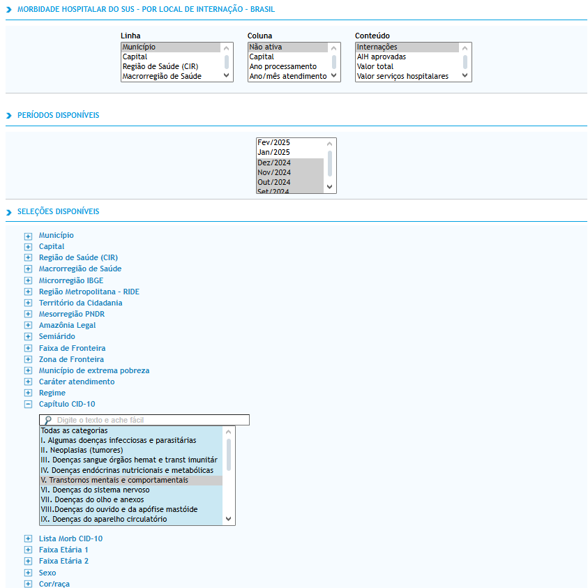
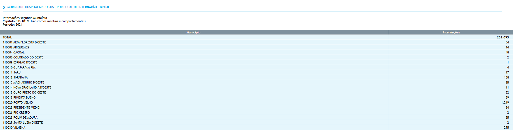

# Estudo Ecológico Sobre as Internações hospitalares por Problemas Psiquiátricos no SUS (DEMO)

_Trata-se de um projeto exploratório que busca melhor entender o fenômeno das internações hospitalares no SUS por condições psiquiatricas. Assim, o projeto busca cruzar determinantes epidemiologicos, geográficos, demográficos, econômicos e sociais para construir conhecimento científico e melhor compreender essa dinâmica_

## Datasets Utilizados no Projeto

| Base de Dados                                                 | Caminho do Arquivo                                                            | Descrição                                                                           | Fonte                                                                                                       |
| ------------------------------------------------------------- | ----------------------------------------------------------------------------- | ----------------------------------------------------------------------------------- | ----------------------------------------------------------------------------------------------------------- |
| Internações por Distúrbios Psiquiátricos                      | data\sus\mental_diseases_jan2024-dec2024\sih_cnv_nibr102443191_53_138_174.csv | Dados sobre hospitalizações psiquiátricas por municipalidade de jan 2024 à jan 2025 | [DATA SUS](http://tabnet.datasus.gov.br/cgi/tabcgi.exe?sih/cnv/nibr.def)                                    |
| Malha Municipal Digital e Áreas Territoriais 2023             | data\geo\BR_Municipios_2023                                                   | Dados geográficos para a projeção, cruzamento dos dados e criação de mapas          | [IBGE](https://www.ibge.gov.br/geociencias/organizacao-do-territorio/malhas-territoriais/15774-malhas.html) |
| População Residente Estimada por Municipalidade - Tabela 6579 | data\population\tabela6579.csv                                                | Dados sobre população estimada por municipalidade para o ano de 2024                | [IBGE SIDRA](https://sidra.ibge.gov.br/tabela/6579)                                                         |

## Formato da Pesquisa no Data SUS

## Mapas Gerados

### Rede Municipal Brasileira

**/arranging_geo_data.ipynb**

[File](/maps/municipalities_geometries.html)

### Municipalidades Com e Sem Reportes

**/municipalities_with_and_without_reports.ipynb**

[File](/maps/municipalities_with_and_without_reports_jan2024-dec2024.html)

### Chorpleth de Número Absoluto de Internações por Municipalidade

**/municipalities_with_and_without_reports.ipynb**

[File](/maps/choropleth_absolute_cases_jan2024-dec2024.html)

### Choropleth: Internações por População por Municipalidade

**/choromap_hospitalizations_by_population.ipynb**

[File](/maps/cases_by_municipality_pop(jan2024-dez2024).html)
